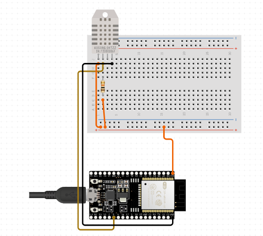

# RemoteTemperatureReader
# ESP32 DHT22 MQTT Sensor

This project demonstrates how to use an ESP32 microcontroller with a DHT22 temperature and humidity sensor to publish sensor data to an MQTT broker. The data can then be used for various applications such as home automation, environmental monitoring, etc.

## Hardware Requirements

- ESP32 microcontroller
- DHT22 temperature and humidity sensor
- LED (optional, used for indication)
- WiFi connection for ESP32

## Schematics

## Software Dependencies

- [Arduino IDE](https://www.arduino.cc/en/software)
- Libraries:
  - [DHT Sensor Library](https://github.com/adafruit/DHT-sensor-library) - for interfacing with the DHT22 sensor
  - [WiFi](https://www.arduino.cc/en/Reference/WiFi) - for connecting to the WiFi network
  - [PubSubClient](https://pubsubclient.knolleary.net/) - for MQTT communication

## Installation and Setup

1. Clone or download this repository.
2. Open the project in the Arduino IDE.
3. Install the required libraries through the Arduino Library Manager if not already installed.
4. Update the following parameters in the code:
   - WiFi SSID and password
   - MQTT broker details (server, port, username, password, topic)
5. Connect the DHT22 sensor and LED to the ESP32 as per the pin configurations in the code.
6. Compile and upload the code to your ESP32 board.

## Usage

1. Once uploaded, the ESP32 will connect to the specified WiFi network.
2. It will then start publishing temperature and humidity data to the specified MQTT topic.
3. You can monitor the data using an MQTT client or integrate it with other applications like Home Assistant.

## Known Issues

- The code includes a workaround for negative temperature values which may vary from standard DHT22 sensor behavior. Further investigation or alternative libraries may be required for precise handling.

## Contributing

Contributions are welcome! If you find any issues or have suggestions for improvements, please open an issue or submit a pull request.

## License

This project is licensed under the MIT License - see the [LICENSE](LICENSE) file for details.
